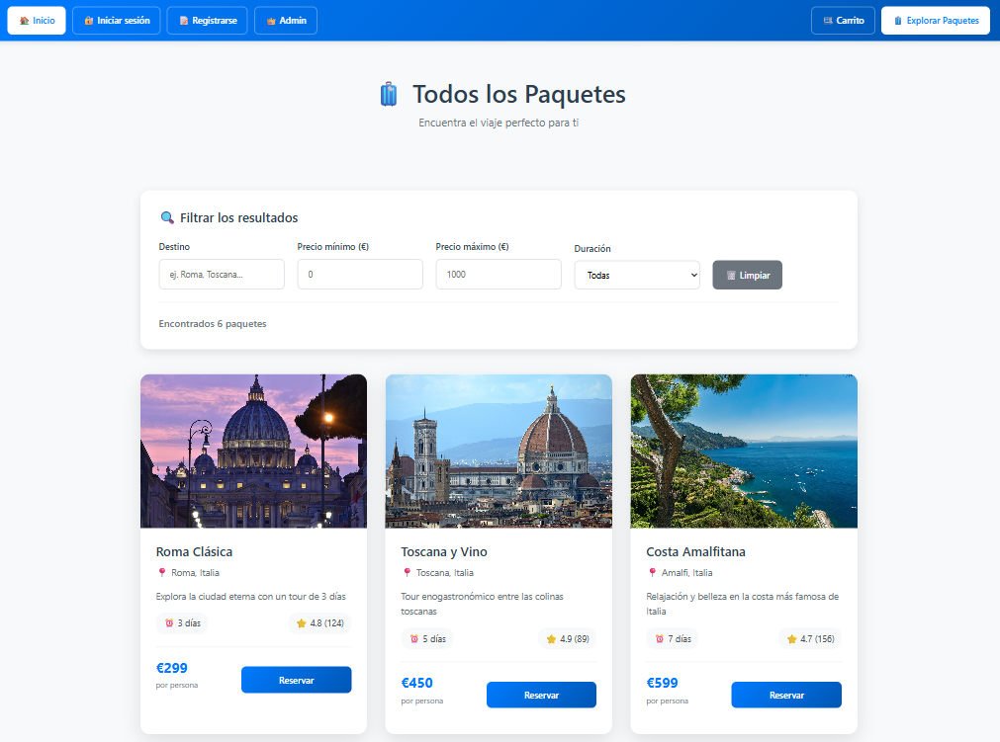

# Agencia de Viajes - Plataforma de Reservas Online

Una aplicación web que simula una agencia de viajes online donde los usuarios pueden comprar paquetes turísticos todo incluido y compartir sus experiencias de viaje con la comunidad.

**Colaboradores del equipo**:

Este proyecto fue desarrollado en grupo con:

- [ralunsebastian](https://github.com/ralunsebastian)
- [MatiCR6284](https://github.com/MatiCR6284)
- [Micolia](https://github.com/Micolia)

## 🌍 Funcionalidades Principales

### 👥 Usuarios Invitados
- Página de inicio
- Página de paquetes turísticos con vistas previas y detalles

### 🔑 Usuarios Registrados
- Página de comunidad para compartir experiencias de viaje
- Carrito de compras con proceso de pago
- Posibilidad de reservar paquetes turísticos
- Página "Mis Viajes" para ver y gestionar reservas

### 🛠️ Administrador
- Acceso dedicado para administradores
- Posibilidad de crear nuevos paquetes

## 🖥️ Frontend

Desarrollado con React

## ⚙️ Backend

El backend está construido con Node y Express, conectado a una base de datos PostgreSQL.

- Proceso de pago del carrito
- Registro de usuarios
- Creación de publicaciones en la comunidad
- Creación de paquetes por parte del

!
!
!
